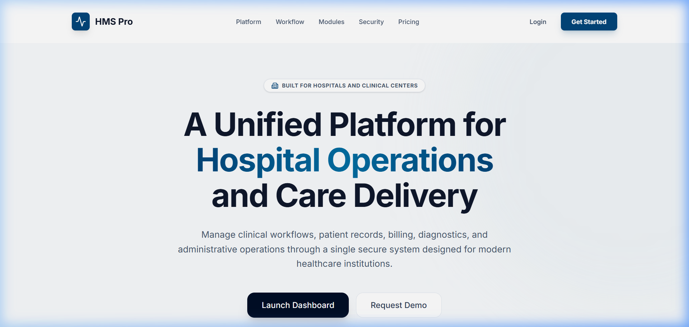
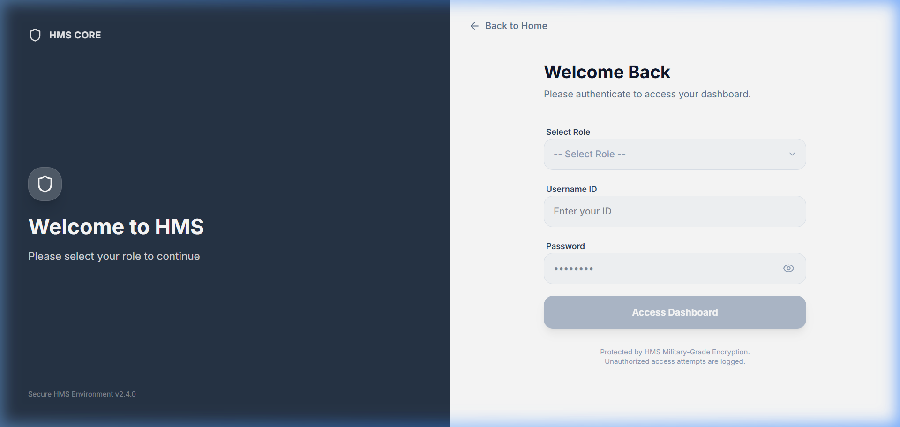
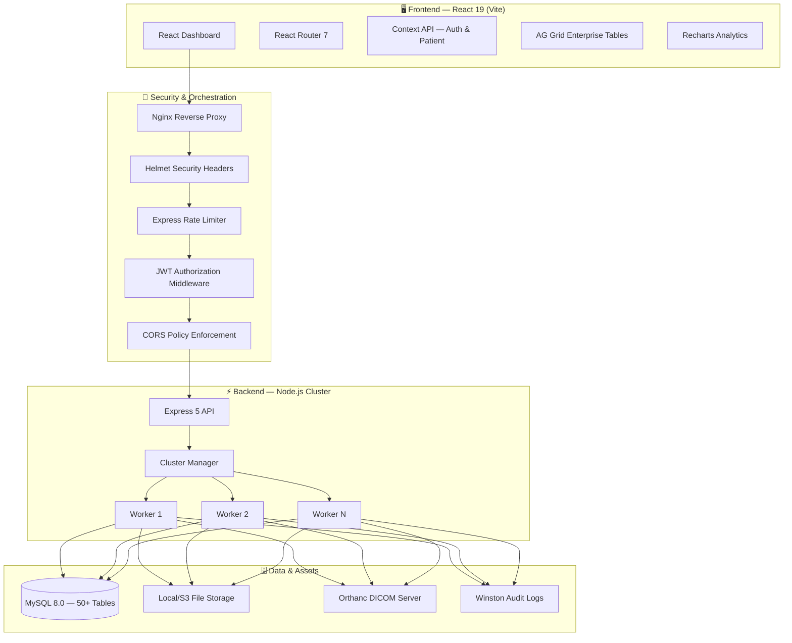
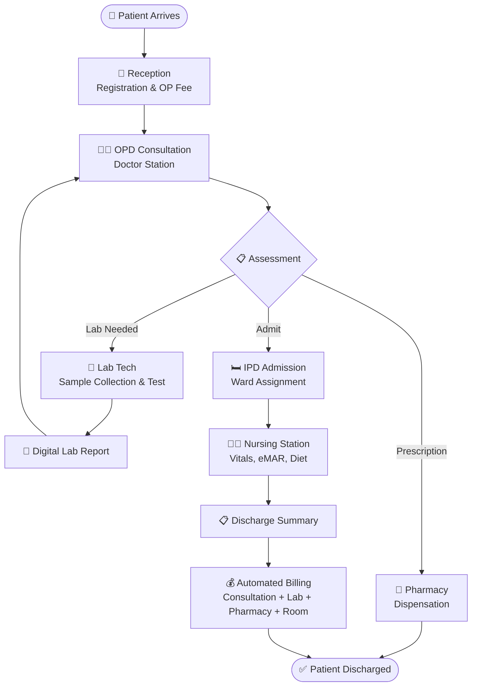
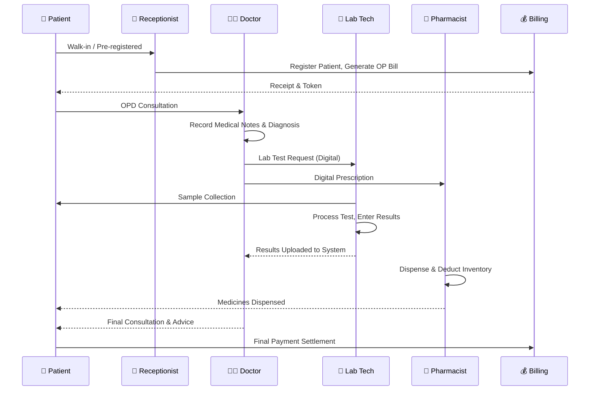
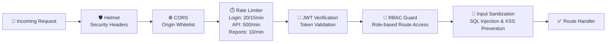
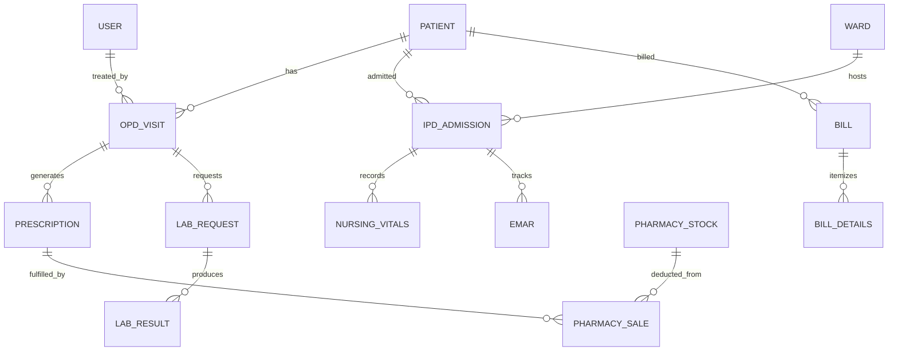
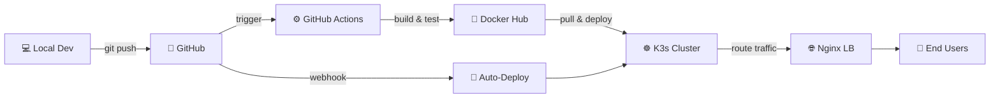

<div align="center">

# 🏥 Lifeline HMS
### Enterprise Hospital Management System

<p align="center">
  
  
  
  
  
  
</p>

<p align="center">
  <b>A full-stack, enterprise-grade Hospital Management System — built to handle real-world clinical workflows with modern web technologies.</b>
</p>

</div>

---

## 🎬 Live Demo

> **Both servers are running concurrently:**
> - 🌐 **Frontend** → `http://localhost:5173`
> - ⚡ **Backend API** → `http://localhost:5000`

> **Demo walkthrough recorded below:**


> *The landing page showcases real-time KPIs: OPD Flow (142), Active Admissions (28), Active Doctors (18), and Revenue Today (₹2.4L).*

---

## 📖 Overview

**Lifeline HMS** is a production-grade, full-stack Hospital Management System engineered to modernize clinical and administrative operations across multi-specialty healthcare institutions.

It implements the complete **Patient Life Cycle Management (PLCM)** — from the moment a patient walks in for registration and OPD consultation, through pharmacy dispensation, laboratory diagnostics, IPD nursing care, and right up to automated discharge billing.

### 🌟 What Makes This Different
- **Real-world data model**: 50+ MySQL tables handling patient records, lab tests, billing, pharmacy inventory, and staff payroll.
- **Enterprise-class API**: Node.js backend running in optional **Cluster Mode** to maximize CPU utilization and handle high concurrency.
- **Professional UI**: React 19 frontend with AG Grid for enterprise-level data tables, Recharts for analytics, and Framer Motion for fluid micro-animations.
- **Security-first design**: JWT authentication, RBAC, Helmet, CORS, rate limiting, and full audit trails via Winston logging.

---

## 🎥 Project Walkthrough

### Landing Page
The public landing page is a fully polished SaaS marketing page showcasing:
- **Live hospital metrics** (OPD Flow, Active Admissions, Active Doctors, Today's Revenue)
- Highlighted portal access for 6 departments: Admin, Doctor, Reception, Pharmacy, Lab, and HR
- Navigation to Login and full-feature highlights



### Login & Role-Based Access
The login interface dynamically loads available roles from the backend. Users authenticate with:
- Staff Username / ID
- Password
- Role selection (enforced via dropdown)



Upon login, users are redirected to their **role-specific dashboard** — a doctor sees their consultation queue; a receptionist sees the patient registration module; a pharmacist sees the dispensary station.

---

## 🏗️ System Architecture



---

## 🔄 Patient Life Cycle Flow



---

## 🔁 Consultation & Lab Sequence



---

## 🧩 Feature Modules

### 🛠️ Administrative & Core
| Module | Capabilities |
|--------|-------------|
| **Admin Dashboard** | Real-time system monitoring, resource usage, API health, activity log |
| **RBAC System** | 8+ role types with granular route-level access control |
| **User Management** | Create/edit staff profiles, credential management, role assignment |
| **Audit Trail** | Full Winston-powered activity logging for compliance |

### 🏥 Clinical Operations
| Module | Capabilities |
|--------|-------------|
| **OPD Management** | Patient registration, token generation, queue management |
| **IPD Management** | Bed assignment, real-time occupancy, admission-to-discharge tracking |
| **Doctor Station** | Digital SOAP notes, prescription writer, X-ray viewer (DICOM) |
| **Nursing (PLCM)** | Vitals charting, eMAR, ward medication administration records |
| **Pantry Module** | Diet management, meal scheduling for admitted patients |

### 🔬 Diagnostics & Inventory
| Module | Capabilities |
|--------|-------------|
| **Laboratory** | Test catalog (100+ tests), automated result entry, PDF reports |
| **Pharmacy** | Inventory management, stock ordering, vendor tracking, POS billing |
| **DICOM Viewer** | Integrated radiology image viewer for X-rays and scans |

### 💰 Finance & HR
| Module | Capabilities |
|--------|-------------|
| **Unified Billing** | Auto-aggregates consultation, lab, pharmacy, and room charges |
| **Payroll** | Attendance tracking, salary processing, employee master data |
| **Financial Reports** | Revenue charts, daily OP summaries, pharmacy sales analytics |

---

## ✨ Key Features

| Feature | Detail |
|---------|--------|
| ⚡ **Real-time Vitals** | Live charting for nursing staff with historical trend display |
| 🔍 **Global Search** | Ultra-fast patient & record search across all hospital data |
| 🛡️ **Multi-tier Security** | JWT sessions, role-guarded routes, input sanitization |
| 📄 **PDF Generation** | One-click Puppeteer-powered bills, prescriptions & lab reports |
| 🖼️ **DICOM Integration** | Orthanc server integration for radiology workflow |
| 📊 **Analytics** | Interactive Recharts dashboards for operations and finance |
| 🌐 **Cluster Mode** | Multi-process Node.js for maximum CPU core utilization |
| 📱 **Responsive UI** | Full mobile and tablet adaptability for bedside use |

---

## 🧰 Tech Stack

### Frontend
| Technology | Version | Purpose |
|-----------|---------|---------|
| **React** | 19 | UI composition with concurrent rendering |
| **Vite** | 7 | Lightning-fast HMR development server |
| **Tailwind CSS** | 4 | Utility-first responsive styling |
| **Framer Motion** | 11 | Premium micro-animations and transitions |
| **AG Grid** | 35 | Enterprise data grid with filtering & sorting |
| **Recharts** | 3 | Hospital metrics and financial analytics charts |
| **React Router** | 7 | Client-side routing with protected routes |
| **Lucide React** | — | Clean, consistent icon system |

### Backend
| Technology | Version | Purpose |
|-----------|---------|---------|
| **Node.js** | LTS | Non-blocking I/O for high concurrency |
| **Express** | 5 | Lightweight, fast API framework |
| **MySQL2** | 3 | Robust relational DB with promise pool |
| **bcryptjs** | — | Secure password hashing |
| **jsonwebtoken** | — | Stateless JWT session management |
| **Puppeteer** | 24 | Server-side PDF generation |
| **Winston** | 3 | Production-grade logging and audit trail |
| **Multer** | 2 | Multi-part file upload handling |
| **Helmet** | 8 | Security headers for all responses |
| **Compression** | — | Gzip response compression |

### Infrastructure
| Technology | Purpose |
|-----------|---------|
| **Docker** | Containerized deployment |
| **K3s / Kubernetes** | Production orchestration with manifests |
| **Nginx** | Reverse proxy and static file serving |
| **Orthanc** | DICOM-compliant medical imaging server |

---

## 📂 Project Structure

```text
server_hms/
├── 📁 client/                    # React 19 Frontend (Vite)
│   ├── src/
│   │   ├── pages/               # Role-specific dashboards & modules
│   │   │   ├── admin/           # System monitoring & user management
│   │   │   ├── doctor/          # Consultation, notes, prescriptions
│   │   │   ├── nursing/         # Vitals, eMAR, ward management
│   │   │   ├── pharmacy/        # Inventory, sales, dispensary
│   │   │   ├── lab/             # Test management & results
│   │   │   └── billing/         # Unified billing & receipts
│   │   ├── components/          # Reusable UI component library
│   │   └── context/             # Global Auth & Patient state
│
├── 📁 server/                    # Node.js Express API
│   ├── src/
│   │   ├── modules/             # Encapsulated business logic
│   │   ├── routes/              # API route definitions
│   │   ├── config/              # DB & environment configuration
│   │   ├── middlewares/         # Auth, validation & security
│   │   └── utils/               # Logger, PDF generator, helpers
│   └── server.js                # Entry point (Cluster + single mode)
│
├── 📁 k8s/                       # Kubernetes deployment manifests
├── 📁 orthanc/                   # DICOM server configuration
├── 📁 documentation/             # Extended technical documentation
├── 🐳 docker-compose.yml         # Full-stack container orchestration
└── 🗄️  hmsdb.sql                 # Complete database schema & seed data
```

---

## ⚙️ Installation & Setup

### Prerequisites
- **Node.js** v18+
- **MySQL** v8.0+
- **Docker** (optional — for containerized deployment)

### 1. Clone & Navigate
```bash
git clone https://github.com/prawinkumar2k/server_hms.git
cd server_hms
```

### 2. Database Setup
```bash
# Create the database
mysql -u root -p -e "CREATE DATABASE hms;"

# Import the full schema & seed data
mysql -u root -p hms < server/hms.sql
```

### 3. Backend Setup
```bash
cd server
npm install

# Create your environment file
cp .env.example .env
# Edit .env with your MySQL credentials (see .env Configuration below)

npm run dev   # Starts on http://localhost:5000
```

### 4. Frontend Setup
```bash
cd ../client
npm install
npm run dev   # Starts on http://localhost:5173
```

---

## 🔑 .env Configuration

Create `server/.env` with the following:

```env
# ==============================
# SERVER
# ==============================
PORT=5000
NODE_ENV=development

# ==============================
# DATABASE
# ==============================
DB_HOST=localhost
DB_USER=root
DB_PASS=your_mysql_password
DB_NAME=hms
DB_PORT=3306

# ==============================
# SECURITY
# ==============================
JWT_SECRET=your_very_long_random_secret_key_here
JWT_EXPIRES_IN=1d

# ==============================
# CLUSTER MODE (Optional)
# ==============================
ENABLE_CLUSTER=false
CLUSTER_WORKERS=4
```

---

## 🐳 Docker Deployment

```bash
# Build and start all services
docker-compose up --build

# Or start specific services
docker-compose up server client db
```

---

## ☸️ Kubernetes (K3s) Deployment

```bash
# Install K3s
bash install-k3s.sh

# Deploy all manifests
kubectl apply -f k8s/

# Check deployment status
kubectl get pods -n hms
```

---

## 🔐 Security Architecture



### Security Layers
| Layer | Implementation | Purpose |
|-------|---------------|---------|
| **Headers** | Helmet.js | XSS, CSP, HSTS, clickjacking protection |
| **Origin** | CORS whitelist | Block unauthorized cross-origin requests |
| **Rate Limits** | express-rate-limit | Tiered brute-force and DDoS protection |
| **Authentication** | JWT (RS256) | Stateless, tamper-proof session tokens |
| **Authorization** | RBAC middleware | Route-level role enforcement |
| **Input** | Regex + parameterized queries | SQL injection & XSS prevention |
| **Logging** | Winston | Full audit trail for compliance |

---

## 🗄️ Database Design

### ER Diagram (Core Entities)



### Database Stats
- **50+ tables** covering every clinical and administrative domain
- **UTF8MB4** charset for international character support
- **Indexed** for sub-millisecond patient and record lookups
- **Timezone-aware** queries (IST `+05:30`)
- **Connection pooling** (50 concurrent connections by default)

---

## 🚀 DevOps & CI/CD Pipeline



---

## 📊 Performance

| Metric | Value |
|--------|-------|
| **API Response** | < 50ms (avg, local DB) |
| **Concurrent Connections** | 50 (DB pool), scalable via cluster |
| **Cluster Mode** | Spans all CPU cores for max throughput |
| **PDF Generation** | Puppeteer headless Chrome, ~1–2s |
| **Frontend Build** | Vite production bundle < 30s |
| **DB Schema** | 50+ tables, 1.2MB schema dump |

---

## 📊 Use Cases

| Setting | Benefit |
|---------|---------|
| **Multi-specialty Hospitals** | End-to-end clinical and financial management |
| **Private Clinics** | Streamlined OPD, billing, and prescription flow |
| **Diagnostic Centers** | Dedicated lab and radiology workflow with PDF reports |
| **24/7 Pharmacy Outlets** | Real-time inventory, vendor management, sales tracking |
| **HR Departments** | Payroll automation and staff management |

---

## 🎯 Engineering Highlights

| Skill Area | Implementation |
|-----------|---------------|
| **Backend Architecture** | Node.js cluster mode, Express 5, modular route/controller/middleware separation |
| **Database Design** | 50+ table normalized schema, connection pooling, parameterized queries |
| **Frontend State** | React Context API for auth and patient data, AG Grid for enterprise tables |
| **Security Engineering** | Multi-tier: Helmet, CORS, rate limiting, JWT, RBAC, input sanitization |
| **DevOps** | Docker multi-stage builds, Kubernetes manifests (K3s), Nginx reverse proxy |
| **Medical Standards** | Orthanc DICOM server for radiology, structured lab result schema |
| **PDF Generation** | Puppeteer server-side rendering for professional medical documents |
| **Logging & Observability** | Winston structured logging with log rotation and audit trails |

---

## 🔮 Roadmap

- [ ] **AI Diagnostics** — ML model integration for automated X-ray anomaly detection
- [ ] **Telemedicine Module** — WebRTC-based video consultations
- [ ] **Patient Mobile App** — Flutter app for appointment booking and bill tracking
- [ ] **HL7 FHIR Integration** — Standard healthcare data interoperability
- [ ] **Multi-branch Support** — Hospital network management across locations
- [ ] **Analytics Dashboard v2** — Predictive bed occupancy and revenue forecasting

---

## 📜 License

Distributed under the **ISC License**.

---

<div align="center">
  <br>
  <p>
    <b>Lifeline HMS</b> — Built with ❤️ by <a href="https://github.com/prawinkumar2k"><b>Prawin Kumar</b></a>
  </p>
  <p>
    <i>Enterprise Hospital Management System · React 19 · Node.js · MySQL 8 · Docker · K8s</i>
  </p>
</div>
