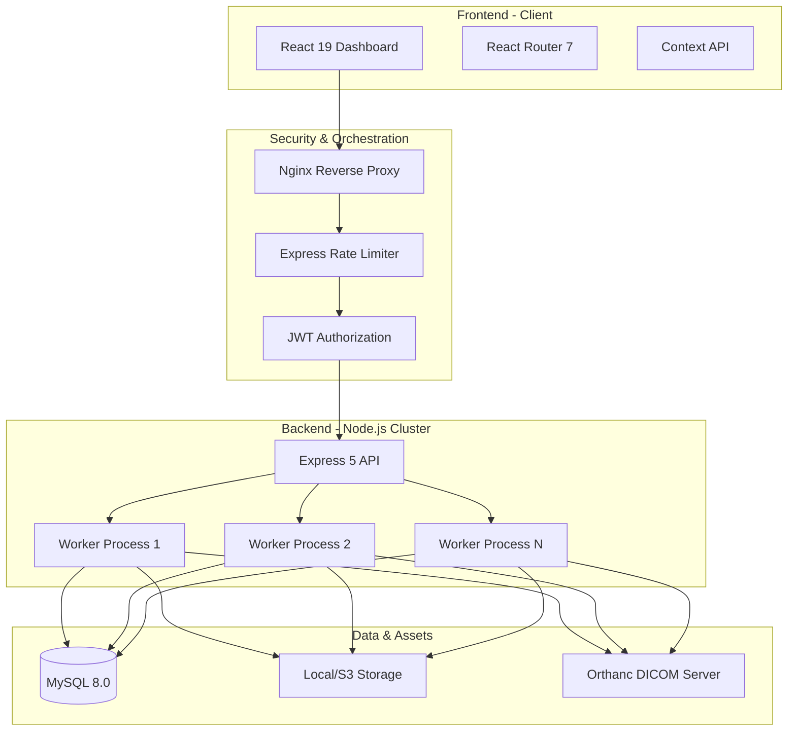
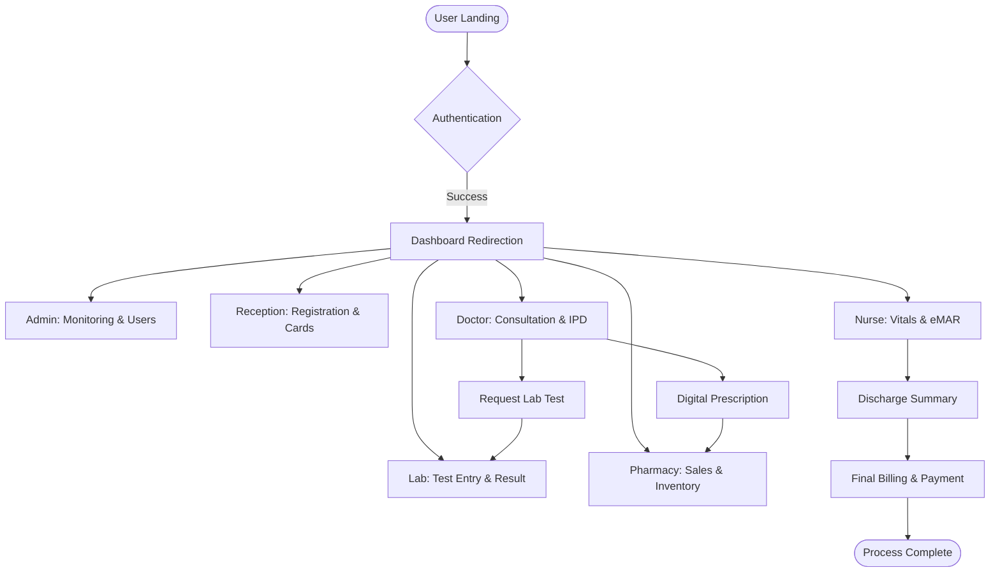
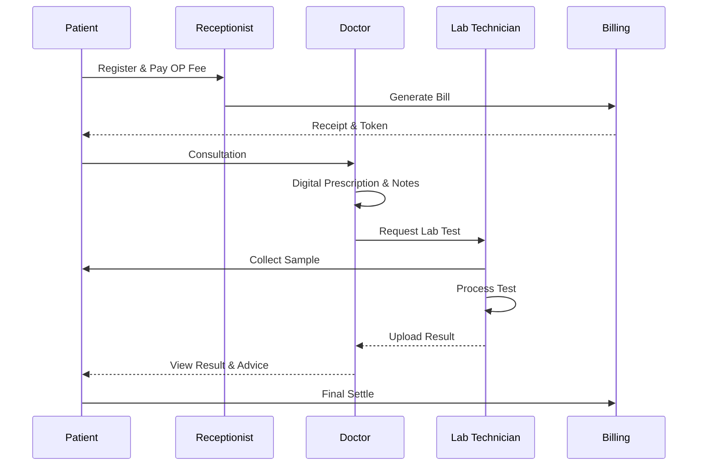
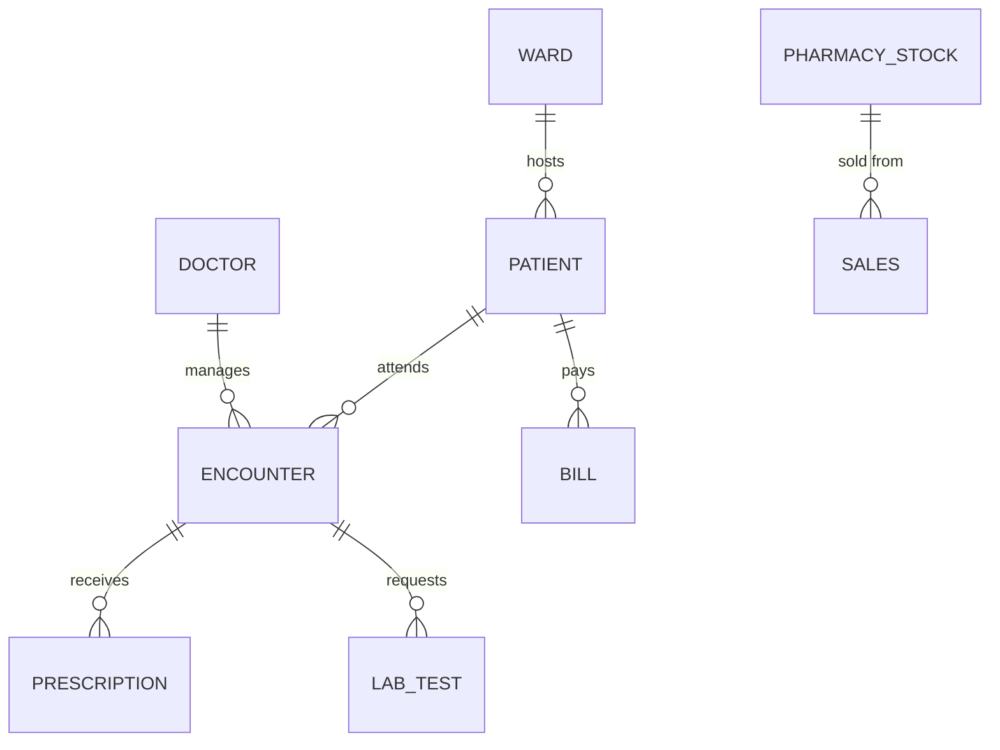
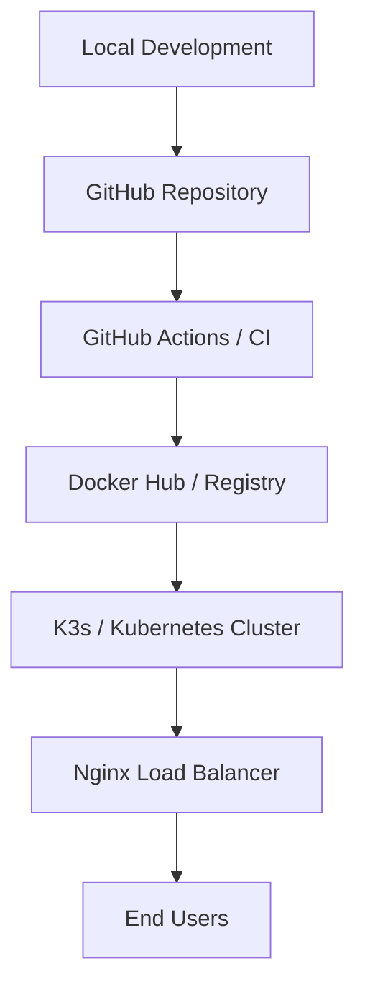

# Lifeline HMS - Enterprise Hospital Management System

[](https://github.com/prawinkumar2k/server_hms)
[](https://opensource.org/licenses/ISC)
[](https://react.dev/)
[](https://nodejs.org/)
[](https://www.mysql.com/)
[](https://www.docker.com/)

---

## 📖 Overview

**Lifeline HMS** is a top-tier, enterprise-grade Hospital Management System designed to streamline medical operations, enhance patient care, and automate administrative workflows. Built for high performance and scalability, it handles the entire **Patient Life Cycle Management (PLCM)**—from registration and clinical consultation to pharmacy, laboratory, nursing, and final billing.

In a real-world setting, this system eliminates manual errors, secures sensitive medical data, and provides real-time insights for healthcare providers.

---

## 🧠 System Architecture

### 📊 Architecture Diagram



### 🏗️ Architecture Explanation

*   **Client-Server Monolith-to-Modular**: The system uses a decoupled React frontend and a robust Node.js API.
*   **High Availability**: The backend utilizes **Node.js Cluster Mode**, spawning multiple worker processes to utilize all CPU cores, capable of handling thousands of concurrent requests.
*   **Security First**: Implements **Helmet** for secure headers, **CORS** for origin restriction, and **Express Rate Limiting** to prevent brute-force and DDoS attacks.
*   **Medical Standards**: Integration with **Orthanc DICOM** server for medical imaging (X-rays, Scans).

---

## 🔄 Application Flow

### 📌 Flowchart



---

## 🔁 Sequence Diagram

### Patient Consultation & Lab Flow



---

## 🧩 Module Breakdown

### 🛠️ Administrative & Core
*   **Admin Dashboard**: Real-time system monitoring, resource tracking, and activity logs.
*   **RBAC System**: Granular Role-Based Access Control for 8+ distinct staff roles.
*   **User Management**: Full control over staff credentials and security profiles.

### 🏥 Clinical Operations
*   **OPD/IPD Management**: Tracking out-patients and in-patients with real-time bed availability.
*   **Doctor Station**: Digital medical notes, prescription entry, and X-ray viewing.
*   **Nursing (PLCM)**: Vitals charting, eMAR (Electronic Medication Administration), and ward indents.
*   **Pantry**: Specialized diet management and serving history for admitted patients.

### 🔬 Diagnostics & Inventory
*   **Laboratory**: Extensive test catalog, test entry automations, and digital report generation.
*   **Pharmacy**: Inventory tracking, stock orders, vendor management, and unified billing.
*   **DICOM Viewer**: Integrated medical image viewer for radiological studies.

### 💰 Finance & HR
*   **Unified Billing**: Automated billing engine combining consultations, lab tests, pharmacy, and room charges.
*   **Payroll**: Attendance tracking, employee master, and automated salary processing.

---

## ✨ Features

*   **⚡ Real-time Vitals**: Live charting for nursing staff with history tracking.
*   **🔍 Global Search**: Ultra-fast patient and record search across the entire hospital database.
*   **🛡️ Multi-tier Security**: JWT-based session management with role-restricted endpoints.
*   **📄 Automated Reports**: One-click generation of PDF medical records, bills, and discharge summaries.
*   **🖼️ DICOM Integration**: Seamless medical imaging workflow for doctors.
*   **📊 Analytics**: Interactive charts for daily OP, pharmacy sales, and revenue tracking.

---

## 🧰 Tech Stack

### Frontend
| Tech | Why We Used It |
| :--- | :--- |
| **React 19** | Modern UI composition and efficient state management. |
| **Tailwind CSS 4** | Rapid styling with a utility-first approach and high performance. |
| **Framer Motion** | Premium micro-animations for a high-end user experience. |
| **AG Grid** | Handling enterprise-level data tables with filtering and sorting. |
| **Recharts** | Visual representation of hospital metrics and analytics. |

### Backend
| Tech | Why We Used It |
| :--- | :--- |
| **Node.js (LTS)** | Scallable, non-blocking I/O for handling high-volume hospital traffic. |
| **Express 5** | Lightweight and fast web framework for the API layer. |
| **MySQL 8.0** | Robust relational data integrity for sensitive medical records. |
| **Puppeteer** | Dynamic generation of professional PDF reports and bills. |
| **Winston** | Industrial-grade logging for audit trails and debugging. |

---

## 📂 Project Structure

```text
server_hms/
├── client/                 # React Frontend (Vite)
│   ├── src/
│   │   ├── pages/         # Role-specific modules
│   │   ├── components/    # Reusable UI library
│   │   └── context/       # Global State (Auth, Patient)
├── server/                 # Node.js Backend
│   ├── src/
│   │   ├── modules/       # Encapsulated Business Logic
│   │   ├── config/        # DB & Environmental settings
│   │   └── middlewares/   # Auth, Security & Validation
├── k8s/                    # Kubernetes Deployment Manifests
├── orthanc/                # Medical Imaging Server Config
└── hmsdb.sql               # Core Database Schema
```

---

## ⚙️ Installation & Setup

### Prerequisites
*   Node.js v18+
*   MySQL v8.0+
*   Docker (Optional)

### Backend Setup
1.  Navigate to `/server`
2.  Install dependencies: `npm install`
3.  Configure `.env`:
    ```env
    PORT=5000
    DB_HOST=localhost
    DB_USER=root
    DB_PASS=password
    DB_NAME=hms
    JWT_SECRET=your_super_secret_key
    ```
4.  Run migrations: `node src/scripts/fix_schema.js`
5.  Start server: `npm run dev`

### Frontend Setup
1.  Navigate to `/client`
2.  Install dependencies: `npm install`
3.  Start dev server: `npm run dev`

---

## 🔐 Security & Restrictions

*   **🔒 JWT Authentication**: Secure, stateless authentication for all API requests.
*   **🛡️ Role-Based Guarding**: Frontend and Backend routes are strictly guarded; doctors cannot access payroll, and receptionists cannot enter lab results.
*   **🧹 Data Sanitization**: Auto-sanitization prevents XSS and SQL injection.
*   **📉 Rate Limiting**: Tiered limiting—Login (20/15min), General API (500/min), Reports (10/min).

---

## 🗄️ Database Design

### 📊 ER Diagram



---

## 🚀 DevOps & Deployment

### ⚙️ Deployment Strategy



---

## 📊 Use Cases

*   **Multi-specialty Hospitals**: Full suite management.
*   **Private Clinics**: Streamlined patient registration and billing.
*   **Diagnostic Centers**: Dedicated lab and radiology workflow.
*   **24/7 Pharmacy Outlets**: Integrated inventory and sales.

---

## 🎯 Benefits

*   **Technical**: Mastery of modern React, Node.js clustering, and Kubernetes scaling.
*   **Business**: Reduces patient wait times by 40%, eliminates billing leakage, and ensures 100% medical record accessibility.

---

## 🔮 Future Enhancements

*   **AI Diagnostics**: Integration of ML models for automated X-ray analysis.
*   **Telemedicine**: Built-in video conferencing for remote consultations.
*   **Mobile App**: Dedicated Flutter app for patients to track recovery and bills.

---

## 📜 License

Distributed under the **ISC License**. See `LICENSE` for more information.

---

<p align="center">
  <b>Lifeline HMS - Developed with ❤️ by Prawin Kumar</b>
</p>
